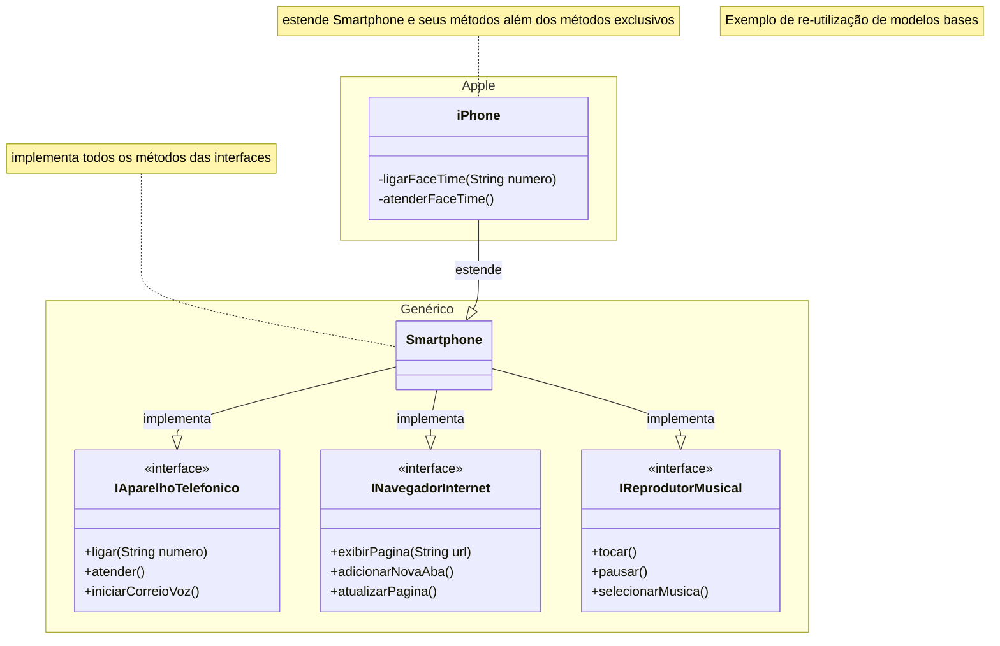

# Modelando o iPhone com UML: Funções de Músicas, Chamadas e Internet

Este repositório foi criado para a entrega do _**Desafio de Projeto**_, cujo título é **Modelando o iPhone com UML: Funções de Músicas, Chamadas e Internet**. Desafio este presente no _bootcamp_ **Desenvolvimento Java com IA** promovido pela [Digital Innovation One (DIO)](https://www.dio.me/).

[Link do enunciado do desafio](https://github.com/digitalinnovationone/trilha-java-basico/tree/main/desafios/poo).

### Diagrama UML

